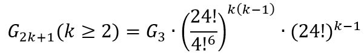
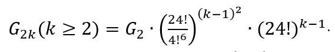

# 了解魔方状态总数的意义
了解魔方状态总数可以了解魔方变化中的守恒量。  
知道了魔方中的守恒量，就能够很快判断一个给定魔方是否有解。  
了解了魔方中的守恒量，就能够知道最难状态的魔方。

# 二阶魔方状态总数
二阶魔方固定最右最上最前那一块之后，剩下7块随机排列，状态也随意，每个块有3种状态。但是最后一块的状态是确定的，可以跟据已经排好的前6块的状态确定，所以分母上除以3.

二阶魔方状态总数为`7!*3^7/3`

# 三阶魔方状态总数
三阶魔方在二阶魔方基础上多了心块和棱块。心块有24种放法，棱块有12块，最后两块的位置是固定的（分母除以2），最后一块的状态是固定的（分母除以2）。

三阶魔方状态总数为`二阶魔方状态总数*24*12!*2^12/4`

# n阶魔方状态总数
奇数阶魔方状态总数

 偶数阶状态总数

从魔方状态总数中，可以发现魔方旋转过程中的守恒量。  
二阶魔方和三阶魔方比较特殊，它们是最小的偶数阶魔方和最小的奇数阶魔方。  
魔方中有以下五类块，这五类块组成了魔方状态的五个项。
* 角块：角块就是一个二阶魔方，角块组成了魔方的骨架。
* 心块：6个面，每个面有一个心，只有奇数阶魔方才有心块，偶数阶魔方没有心块。心块指的是魔方每个面的中心。
* 面块：面上除心块以外的全部块，面块只有一个面颜色可见。魔方每个面上有4个块在同一轨道上，整个魔方每个轨道有24个块。同一轨道上的块是完全可以全排列且状态自由。
* 边块：棱上除棱心以外的块，每个边块有两个面颜色可见。正方体有12条边，每条边上有两个对称的块，它们在同一轨道上但是它们并不等价。
* 边心块：只有奇数阶魔方才有边心块。

# 参考资料
[知乎：如何计算魔方状态总数](https://zhuanlan.zhihu.com/p/35339755)  
[知乎：n阶魔方有几个等价类](https://www.zhihu.com/question/49623083)