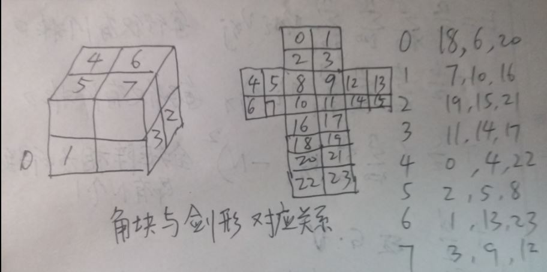

# 编号示意图

# 固定最上最前最右小方块
对于魔方,不转动它,可以有`4*6=24`种放置方法,这24种放置方法对应的是同一个魔方状态.  
为了归一化,把红蓝白角块置于最前最上最右位置.这样一来,其余小方块全排列`7!`,其余小方块的状态为`3^6`,即最后一个小方块是不自由的,它的状态是由其余7个小方块决定的.  
那么给定6个小方块的状态,如何求第七块小方块的状态?

# 小方块的状态定义
每个小方块有三种状态:0,1,2.每个小方块必然包含红面，魔方包含的每个小方块都是一个六面体，即便它的红色是隐藏的，它实际上也是有红色面的.    
红面可以垂直于x轴或者y轴或者z轴,垂直于x轴称为0态,垂直于y轴为1态,垂直于z轴为2态.  

# 小方块的位置定义
以最下最左最后那个小方块为原点,表示为(0,0,0),以从后往前为x轴,以从左往右为y轴,  以从下往上为z轴建系.可以为每一个小方块确定一个(x,y,z)坐标.    
- 0,0,0=0 黄橙绿
- 1,0,0=1 黄红绿
- 0,1,0=2 黄橙蓝
- 1,1,0=3 黄红蓝
- 0,0,1=4 白橙绿
- 1,0,1=5 白红绿
- 0,1,1=6 白橙蓝
- 1,1,1=7 白红蓝

这样就为每个位置进行了编号,同时也为每个小方块进行了编号.
为颜色进行编码,设6个未知数r,y,w,g,o,b.
则按照上面各个小块的编码有:
- y+o+g=0
- y+r+g=1
- y+o+b=2
- y+r+b=3
- w+o+g=4
- w+r+g=5
- w+o+b=6
- w+r+b=7

这是一个6元线性方程组,它的秩为4,它的通解为
`(r,y,w,g,o,b)=(1,2,6,-2,0,0)+k1(0,1,1,-1,0,-1)+k2(-1,1,1,0,-1,0)`
为了使颜色区分开来,不能让orange和red与其它颜色相同.故可取k1=3,k2=0,得(1,5,9,-5,0,-3)，此法可以迅速跟据颜色找到小块的编号。

# 魔方24色表示法
将魔方展开成剑形,从左到右,从上到下写出24个小面的颜色,字符用wrgoby表示,或者用红黄蓝绿橙白表示.(不一定按照红心白发蓝右臂方式展开,程序可以自动调整成红心白发蓝右臂).
这种表示法存在很多冗余,但这种冗余可以作为校验,用来检验输入是否正确.

# 魔方的位置-状态表示法
在0~7七个位置,找到在该位置的小方块的编号,状态.这种表示法需要8个小方块的编号和状态,共需要16个数字.  
还有另一种表示方法,知道了各个小方块的编号,用八个数字表示第0号,第1号...小方块的位置编号,另外8个数字表示第0号,第1号...小方块的状态.这种表示方法也是只需要16个数字.    
后面这种方法更好,在状态转移过程中更容易计算,因为它关注的是每个小方块,而不是哪个位置上是谁.做变换时只需要考虑当前一个小方块的感受就可以了,不要考虑全局小方块.
比如,前一种方法在表示左旋,下旋,后旋时,需要考虑左面四块位置互换和状态改变,这个操作类似于将0,1,2,3变为1,2,3,0,即4个数字循环替换.     
后一种表示方法只需要考虑每个小方块在该操作下发生的改变即可.    
状态表示不同,深刻影响编程复杂度.本程序使用后一种表示方法.   

# 魔方的最简表示法
固定了魔方的最上最前最右小方块,需要7个位置编号,6个状态编号.  
