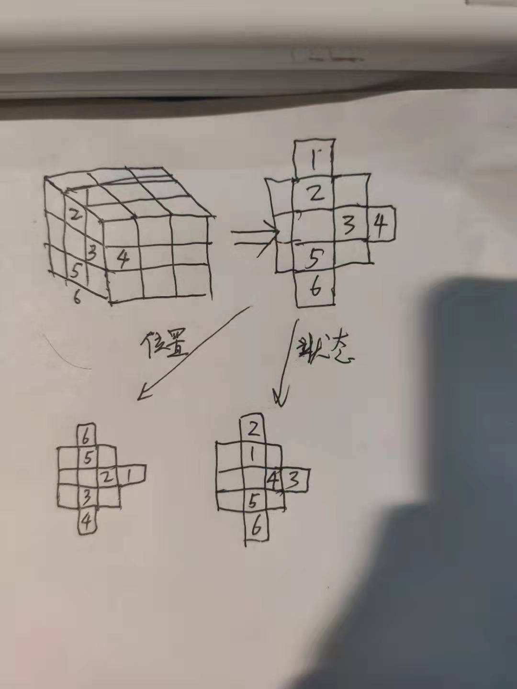
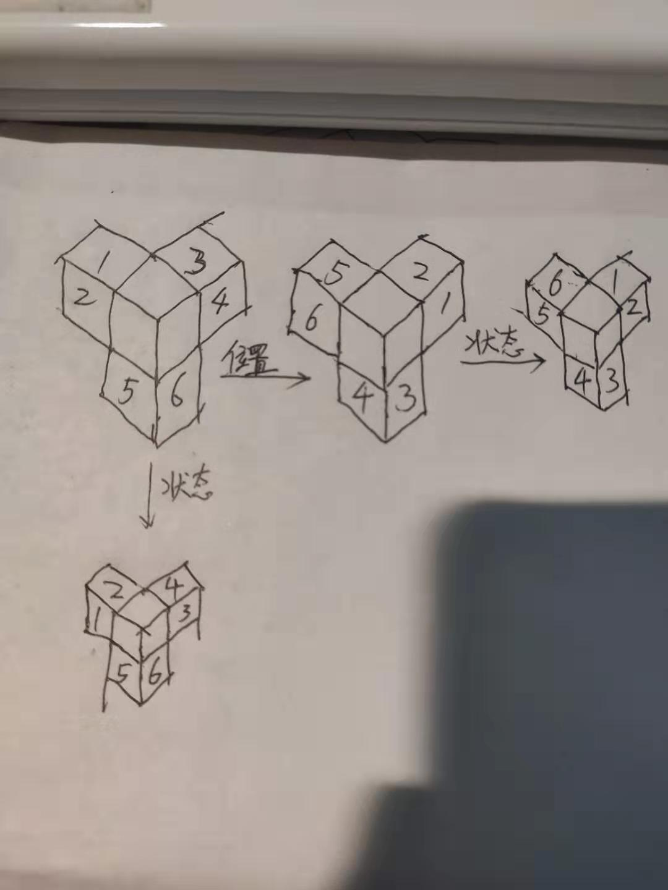

使用魔方求解器推断出来的魔方公式，只需要6个公式就能够还原魔方。

# 八个角块
八个角块构成一个二阶魔方。直接使用二阶魔方求解即可。
相邻块为0号块和1号块。  
改变相邻块的状态
```
后后左后下下后后下左后左左左下左下下
```
改变相邻两块的位置，改变0,1两块的位置,不改变状态
```
下后下下后左后后左下左后后后左
```
# 6个心块
六个心块可以通过只旋转棱的方式快速达成。

# 右面的上右下三个块
三块可同时旋转，旋转过程中像刚体一样。
状态只能同时变两块。
  
改变右面的三个小块,三个小块顺序为:上右下
其中左方块始终固定，不必考虑
交换上右两块的状态,不改变位置
```plain
后2下左2下下
左2左2左2
后2后2后2
左下下后2后2
左2左2下下
左2左2后2后2
下左左下
```

交换“上右下”三块的位置和状态，此操作周期为3（和二阶魔方状态公式一样）
```plain
后2后2后2后
左2左2左2
下2下2左下2下2下2下
左左左下2下2
左2后2后2后后
```
在左面固定的情况下，一共有：
上右下，这是完美状态，但是可能上右状态恰好相反
右下上：执行第一遍
下上右：执行第二遍
执行第三遍则编程上右下完美状态

三种合法位置。


# 角落三块
正方体有八个角，每个角对应3个边块。以最前，最左，最上那个角为研究对象。  
魔方的角落三块变换法则：
* 角落发生顺时针或活着逆时针旋转，3个边块的颜色就像风扇一样维持不动

* 角落中的三块有两块可以同时变色（不能三块同时变色也不能只有一块变色）


改变状态不改变位置：改变顶面上两个边块的状态，下边那个边块完全不动。
```plain
左2左左左下下下
左左下左2左
下下下左2左2
后后左左下下下
左左后后下下下
左左下
```

改变三个块的位置，此操作周期为3。
```plain
后2后2左后2后2
下2下2后后
左后后下下后
下2下2后2后2后2
左2左2左左
后下2下2后2后2后2
```

使用以上六个公式可以实现三阶魔方的还原。